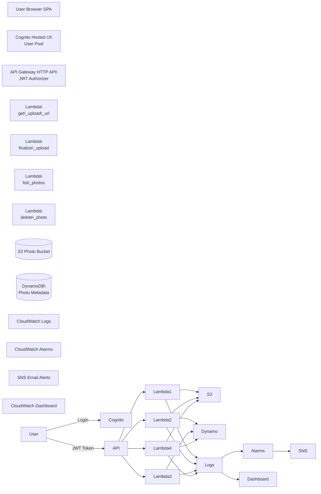

\# Secure Serverless Photo Platform (AWS + Terraform)


!\[AWS](https://img.shields.io/badge/AWS-Serverless-orange?logo=amazonaws)
!\[Terraform](https://img.shields.io/badge/IaC-Terraform-purple?logo=terraform)
!\[Lambda](https://img.shields.io/badge/AWS-Lambda-yellow?logo=awslambda)
!\[DynamoDB](https://img.shields.io/badge/AWS-DynamoDB-blue?logo=amazondynamodb)
!\[Cognito](https://img.shields.io/badge/Auth-Amazon%20Cognito-red?logo=amazonaws)
!\[API Gateway](https://img.shields.io/badge/AWS-API%20Gateway-green?logo=amazonaws)
!\[CI/CD](https://img.shields.io/badge/CI/CD-GitHub%20Actions-black?logo=githubactions)


A production-minded serverless photo platform built on \*\*AWS\*\* and provisioned entirely with \*\*Terraform\*\*.


This project demonstrates secure identity boundaries, controlled file ingestion, per-user data isolation, least-privilege IAM, infrastructure as code, CI/CD automation, and operational observability — core competencies expected from \*\*Cloud and DevOps engineers\*\*.

\# Secure Serverless Photo Platform (AWS + Terraform)


A production-minded serverless photo platform built on \*\*AWS\*\* and provisioned entirely with \*\*Terraform\*\*.


This project demonstrates secure identity boundaries, controlled file ingestion, per-user data isolation, least-privilege IAM, infrastructure as code, CI/CD automation, and operational observability — core competencies expected from \*\*Cloud and DevOps engineers\*\*.


---


\# Project Overview


Authenticated users can:


\- Log in via \*\*Amazon Cognito (OAuth2 Authorization Code Flow + PKCE)\*\*

\- Upload images securely using \*\*presigned S3 PUT URLs\*\*

\- Finalize uploads server-side with \*\*validation and controlled promotion\*\*

\- View \*\*only their own photos\*\*

\- Delete \*\*only their own photos\*\*

\- Trigger fully \*\*logged and monitored backend operations\*\*


The architecture intentionally avoids common serverless security issues:


\- Orphaned S3 objects  

\- Client-side validation bypass  

\- Cross-tenant data exposure  

\- Over-permissive IAM policies  


---


\# Architecture Diagram





---


\# Secure Upload Flow


The platform uses a \*\*two-step upload architecture\*\* to prevent invalid files and orphaned uploads.


\## Step 1 — Request Upload URL


Client requests a presigned upload URL:


```

POST /upload-url

```


Lambda generates a \*\*temporary S3 presigned PUT URL\*\*.


Files upload to:


```

uploads/<uuid>.<ext>

```


This temporary location prevents unverified files from entering the main photo storage.


---


\## Step 2 — Finalize Upload


Client then calls:


```

POST /finalize

```


The backend Lambda performs validation:


1\. Confirm object exists (`HeadObject`)

2\. Validate file size

3\. Validate file type

4\. Copy file to final location:


```

photos/<uuid>.<ext>

```


5\. Delete temporary upload

6\. Write metadata to DynamoDB


This guarantees:


\- Server-side validation  

\- No orphan uploads  

\- Controlled promotion of files  


---


\# Data Model


Photo metadata is stored in \*\*Amazon DynamoDB\*\*.


Partition key design enforces \*\*per-user isolation\*\*.


```

PK: USER#<user\_sub>

SK: PHOTO#<timestamp>#<uuid>

```


Example record:


```

PK: USER#abc123

SK: PHOTO#1707334442#e7fa1c...

```


Advantages:


\- Efficient per-user queries  

\- Strong tenant isolation  

\- Time-ordered results  


---


\# Security Architecture


Security is built into every layer.


\## Authentication


Handled by \*\*Amazon Cognito\*\*


Features:


\- Hosted login UI

\- OAuth2 Authorization Code Flow

\- PKCE protection

\- JWT tokens issued after login


---


\## Authorization


API Gateway verifies JWT tokens using a \*\*JWT Authorizer\*\*.


Each Lambda extracts the authenticated user identity from:


```

requestContext.authorizer.jwt.claims.sub

```


Users can only access their own resources.


---


\## S3 Security Controls


The S3 bucket enforces:


\- TLS-only access  

\- Server-side encryption  

\- Public access blocking  

\- Ownership controls  


Uploads are only allowed via \*\*presigned URLs generated by Lambda\*\*.


---


\## IAM Least Privilege


Each Lambda receives a minimal IAM policy.


Typical permissions include:


```

s3:PutObject

s3:GetObject

s3:DeleteObject

dynamodb:PutItem

dynamodb:Query

```


No Lambda receives unnecessary permissions.


---


\# Infrastructure as Code


All infrastructure is defined using \*\*Terraform\*\*.


Provisioned services include:


\- Amazon Cognito User Pool

\- Cognito App Client

\- API Gateway HTTP API

\- Lambda Functions

\- DynamoDB Table

\- S3 Bucket

\- IAM Roles and Policies

\- CloudWatch Logs

\- CloudWatch Alarms

\- SNS Alerts

\- CloudWatch Dashboard


Project structure:


```

photo-app-terraform

│

├── terraform

│   ├── main.tf

│   ├── cognito.tf

│   ├── alerts.tf

│   ├── variables.tf

│   └── outputs.tf

│

├── lambda

│   ├── get\_upload\_url

│   ├── finalize\_upload

│   ├── list\_photos

│   └── delete\_photo

│

├── frontend

│   └── index.html

│

└── README.md

```


---


\# CI/CD Pipeline


Infrastructure deployment is automated using \*\*GitHub Actions\*\*.


The pipeline:


1\. GitHub Actions uses \*\*OIDC federation\*\*

2\. GitHub assumes an AWS IAM role

3\. Terraform executes automatically


Pipeline steps:


```

terraform fmt

terraform init

terraform validate

terraform plan

```


No static AWS credentials are stored in GitHub.


Access is granted using:


```

sts:AssumeRoleWithWebIdentity

```


---


\# Observability


Operational monitoring is implemented using \*\*CloudWatch and SNS\*\*.


\## Logging


Each Lambda logs to:


```

/aws/lambda/<function-name>

```


---


\## Metrics and Alerts


CloudWatch alarms monitor:


\- Lambda errors

\- Lambda throttling

\- API Gateway 5XX errors

\- API latency


---


\## Notifications


Critical alarms send alerts through:


```

Amazon SNS Email Notifications

```


---


\## Dashboard


A CloudWatch dashboard provides visibility into:


\- API traffic

\- Lambda execution metrics

\- Error rates

\- Latency


---


\# Local Development


Terraform commands:


```

cd terraform


terraform init

terraform plan

terraform apply

```


Frontend can be served locally using:


```

python -m http.server

```


---


\# Skills Demonstrated


This project demonstrates practical experience with:


\- Serverless architecture design

\- OAuth2 authentication flows

\- Secure file ingestion patterns

\- Infrastructure as Code (Terraform)

\- CI/CD with GitHub Actions

\- AWS IAM least-privilege design

\- Observability and monitoring

\- Multi-tenant data modeling


---


\# Potential Improvements


Future enhancements could include:


\- CloudFront CDN for faster image delivery

\- Image resizing pipeline with Lambda

\- SQS processing for asynchronous workflows

\- Lifecycle archiving to Glacier

\- AWS WAF for API protection

\- Frontend hosting with S3 + CloudFront


---


\# Author


Cloud / DevOps Engineering Portfolio Project

